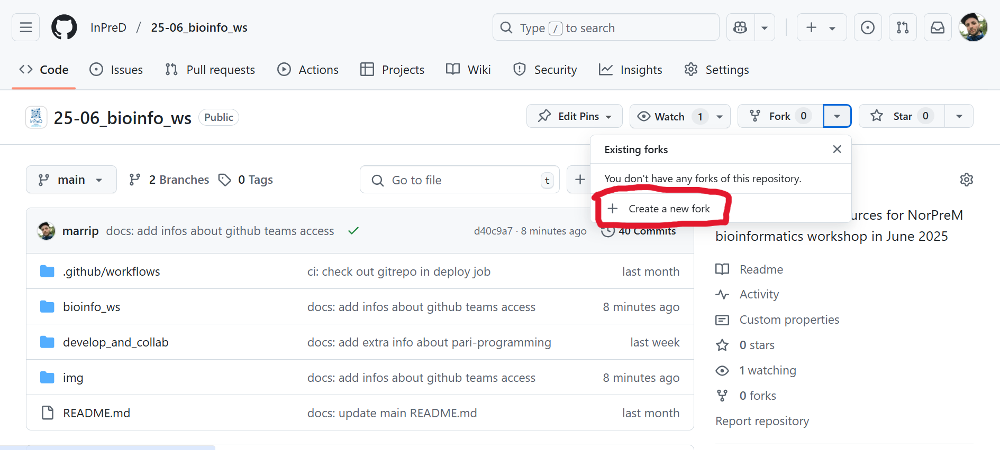

# Bioinformatics session

3rd Annual workshop on bioinformatics and variant interpretation in InPreD

<https://inpred.github.io/25-06_bioinfo_ws/bioinfo_ws>


---

## 1. Unit testing

---

### What is unit testing?

- test smallest piece of code that can be logically isolated in software application (function, subroutine, method)
- the smaller the better - more granular view of what is going on; also faster
- should not cross systems (database, filesystem, network) -> integration and functional tests

---

### Example

```python
# calculator.py
def add(x, y):
    """add numbers"""
    return x + y
```

```python
# test_calculator.py
import calculator

def test_add():
    assert calculator.add(1, 2) == 3
```

---

### Why do we need unit testing?

- **early defect detection** - catch bugs before integration with other components
- **code quality improvement** - reliable, maintainable, scalable
- **facilitates refactoring** - depending on level of refactoring, unit tests might change as well
- **better documentation** - unit tests are examples of how the code is expected to behave
- **faster development cycles** - catch bugs early, reduced manual testing
- **enables more frequent releases** - quickly identify and fix issues

---

### How to design a unit test?

- identify the unit (function, method)
- what is its functionality?
- what is the input (correct and incorrect)?
- how to handle incorrect input? (edge cases, invalid data)
- what does it return?
- intended output and errors/exceptions should be tested for

---

### Set up unit testing for your functions

- install pytest

  ```bash
  $ pip install pytest
  ```

- add your function to a module at `my_module/my_module.py`
- add your unit test at `my_module/tests/my_module_test.py`
- in the test file import your module `from my_module.my_module import my_function`

---

### First exercise

- go to https://github.com/InPreD/25-06_bioinfo_ws_unit_testing and create a fork

  

---

- deselect to only fork `main` branch and `Create fork`

  

---

- start codespace in forked repository

  

---

### First exercise


---

### First exercise

- pytest was already installed in the codespace
- the suggested layout was already applied
- create a branch for your work:

  ```bash
  $ git checkout -b unit-tests-<your name>
  ```

- start with the first exercise in `first/tests/first_test.py`
- whenever you are done, commit your changes (use [commit message conventions](https://inpred.github.io/24-03_bioinfo_ws/#19)):

  ```bash
  $ git add first/tests/first_test.py
  $ git commit -m "test: <your commit message>"
  ```

- and we push them to GitHub:

  ```bash
  $ git push --set-upstream origin unit-tests-<your name>
  ```

---

### Handle exceptions in unit tests

- functions can raise exceptions and we would like to test for those
- import `pytest` to have access to `raises()`
- add `with`-block to handle the exception:

  ```python
  import calculator
  import pytest
  
  def test_add_exception():
      with pytest.raises(TypeError):
          assert add("one", "two") == None
  ```

---

### Second exercise

- continue with the second exercise in `second/tests/second_test.py`
- whenever you are done, commit your changes (use [commit message conventions](https://inpred.github.io/24-03_bioinfo_ws/#19)):

  ```bash
  $ git add second/tests/second_test.py
  $ git commit -m "test: <your commit message>"
  ```

- and we push them to GitHub:

  ```bash
  $ git push
  ```

---

### Make unit tests table-driven by using parametrize

- having more than one test case results in repeating a lot of code (one function per test case)
- to condense this as much as possible (ideally one unit test per function), we can use the `pytest` decorator `parametrize`
- again, import `pytest` to gain access to the decorator
- add the decorator `@pytest.mark.parametrize` as a header to your function
- define the required variables (input, exception, output)
- add your test cases as a list of tuples (one tuple per case)
- also use `nullcontext` from the module `contextlib` to account for cases without exceptions

---

```python
import calculator
import pytest

from contextlib import nullcontext

@pytest.mark.parametrize(
    "x, y, exception, want",
    [
        (1, 2, nullcontext(), 3),
        ("one", "two", pytest.raises(TypeError), None)
    ]
)
def test_add(x, y, exception, want):
    with exception:
        assert add(x, y) == want
```

---

### Third exercise

- continue with the third exercise in `third/tests/third_test.py`
- whenever you are done, commit your changes (use [commit message conventions](https://inpred.github.io/24-03_bioinfo_ws/#19)):

  ```bash
  $ git add third/tests/third_test.py
  $ git commit -m "test: <your commit message>"
  ```

- and we push them to GitHub:

  ```bash
  $ git push
  ```

---

### Use GitHub action to automatically run tests on push

- add `.github/workflows/main.yml`:

  ```yaml
  name: Python test
  on: push
  
  jobs:
    test:
      name: Run unit tests
      runs-on: ubuntu-latest
      steps:
        - 
          name: Check out the repo
          uses: actions/checkout@v4
        -
          name: Set up Python 3.12.8
          uses: actions/setup-python@v4
          with:
            python-version: 3.12.8
        - 
          name: Install dependencies
          run: pip install -r requirements.txt
        - 
          name: Unit testing 
          uses: pavelzw/pytest-action@v2
          with:
            verbose: true
            emoji: true
            job-summary: true
            custom-arguments: -q
            click-to-expand: true
            report-title: 'Bioinfo workshop unit testing'
  ```

---

### Use GitHub action to automatically run tests on push

- if you don't want to write all of that, merge the branch containing the file into your branch:

  ```bash
  $ git merge origin/add-github-action
  ```

---

### Fourth exercise

- write unit tests for the functions in `fourth/fourth.py`
- whenever you are done, commit your changes (use [commit message conventions](https://inpred.github.io/24-03_bioinfo_ws/#19)):

  ```bash
  $ git add third/tests/third_test.py
  $ git commit -m "test: <your commit message>"
  ```

- and we push them to GitHub:

  ```bash
  $ git push
  ```

---

Thank you for your attention!

Day 1 done!


---

## 2. Nextflow

---

### What is nextflow?

- workflow orchestration engine, domain-specific language (in contrast to general-purpose language, e.g. python)
- easy to write data-intensive computational workflows
- extension of groovy which is a superset of Java
- core features:
  - portability and reproducibility
  - scalability of parallelization and deployment
  - integration of existing tools, systems, and industry standards

---

### How does it work?

#### Processes and channels

- different processes joined together - each written in any language that can be executed by Linux platform
- independently and isolated processes - not sharing common (writable) state
- communication via asynchronous first-in, first-out (FIFO) queues, called `channels`

  

---

#### Execution abstraction

- process = *what* is executed <-> executor = *how* it is executed
- provides abstraction between workflow’s functional logic and underlying execution system/runtime
- workflow runs seamlessly on local computer, HPC cluster or cloud

  

---

### Let's get started

- go to https://github.com/InPreD/25-06_bioinfo_ws_nextflow, fork it and start codespace

  

---

- create a branch for your work

  ```bash
  $ git checkout -b nextflow-<your name>
  ```

- create a new folder `hello_world`, `cd hello_world` and create a file `hello_world.nf`
- write a workflow which outputs a file containing "Hello World!"

---

```java
#!/usr/bin/env nextflow

/*
 * Use echo to print 'Hello World!' to a file
 */
process sayHello {

    output:
        path 'output.txt'

    script:
    """
    echo 'Hello World!' > output.txt
    """
}

workflow {

    // emit a greeting
    sayHello()
}
```

---

- try to run it

  ```bash
  $ nextflow run hello_world.nf
  ```

  

- check if you can find `work/33/7106de/output.txt` (the hashes are randomly generated by nextflow so check with `work/*/*/output.txt` if you are unsure which hash to use)
- explore the other files that are in `work/33/7106de/`

---

- add a directory to which results should be published

  ```java
  process sayHello {
  
      publishDir 'results', mode: 'copy'
  
      output:
          path 'output.txt'
      ...
  }
  ```

---

- add a greeting variable

  ```java
  process sayHello {
  
      publishDir 'results', mode: 'copy'
  
      input:
          val greeting
  
      output:
          path 'output.txt'
      
      script:
      """
      echo '$greeting' > output.txt
      """
  }

  workflow {
  
      // emit a greeting
      sayHello(params.greeting)
  }
  ```

  ```bash
  $ nextflow run hello_world.nf --greeting 'Heisann!'
  ```

---

- move the `params.greeting` into the `hello_world.nf`:

  ```java
  params.greeting = 'Heisann!'

  process sayHello {
  
      publishDir 'results', mode: 'copy'
      ...
  }
  ```

  ```bash
  $ nextflow run hello_world.nf
  ```

  ```bash
  $ nextflow run hello_world.nf --greeting 'Hejsan!'
  ```

---

- transform greetings into a channel

  ```java
  process sayHello {
  
      input:
          val greeting
  
      output:
          stdout
      
      script:
      """
      echo '$greeting'
      """
  }

  workflow {
  
      greeting_ch = Channel.of('Alo', 'Salut', 'Sunt eu').view()
      // emit a greeting
      sayHello(greeting_ch) | view
  }
  ```
  
  ```bash
  $ nextflow run hello_world.nf -ansi-log false # run it several times
  ```

---

#### Channels

- processes communicate through channels
- two major properties:
  - Sending a message is an asynchronous (i.e. non-blocking) operation
  - Receiving a message is a synchronous (i.e. blocking) operation
- please refer to the [nextflow docs about channels](https://www.nextflow.io/docs/latest/channel.html)

---

- create a `.csv` file containing our greetings which will serve as input

  ```csv
  Alo
  Salut
  Sunt eu
  ```

- create channel from the file using the channel factory `fromPath()`

  ```java
  workflow {
  
      greeting_ch = Channel.fromPath(params.greeting).view()
      // emit a greeting
      sayHello(greeting_ch) | view
  }
  ```

  ```bash
  $ nextflow run hello_world.nf -ansi-log false --greeting greetings.csv
  ```

---

- try to manipulate a channel by using the operators `splitCsv()` and `map()`

  ```java
  workflow {
  
      greeting_ch = Channel.fromPath(params.greeting)
                           .view( it -> "Before splitCsv: $it" )
                           .splitCsv()
                           .view( it -> "After splitCsv: $it" )
                           .map( item -> item[0] )
                           .view( it -> "After map: $it" )
      // emit a greeting
      sayHello(greeting_ch) | view
  }
  ```

  ```bash
  $ nextflow run hello_world.nf -ansi-log false --greeting greetings.csv
  ```

- please refer to the [nextflow docs about channel operators](https://www.nextflow.io/docs/latest/reference/operator.html)

---

- add a second process

  ```java
  process convertToUpper {

      input:
          val lower

      output:
          stdout

      script:
      """
      echo '$lower' | tr '[a-z]' '[A-Z]'
      """
  }
  ```

---

- include the process in the workflow and link it to the first one

  ```java
  workflow {
  
      greeting_ch = Channel.fromPath(params.greeting)
                           .view( it -> "Before splitCsv: $it" )
                           .splitCsv()
                           .view( it -> "After splitCsv: $it" )
                           .map( item -> item[0] )
                           .view( it -> "After map: $it" )
      // emit a greeting
      sayHello(greeting_ch) | view
      convertToUpper(sayHello.out) | view
  }
  ```

  ```bash
  $ nextflow run hello_world.nf -ansi-log false --greeting greetings.csv
  ```

---

- run first process inside a container

  ```java
  process sayHello {
  
      container 'ubuntu:24.04'
      input:
          val greeting
  
      output:
          stdout
      
      script:
      """
      echo '$greeting'
      """
  }
  ```

- add `nextflow.config` containing

  ```conf
  docker.enabled = true
  ```

- please refer to the [nextflow docs on configuration](https://www.nextflow.io/docs/latest/config.html)

---

- check your docker images

  ```bash
  $ docker images
  ```

- now run

  ```bash
  $ nextflow run hello_world.nf -ansi-log false --greeting greetings.csv
  ```

- check your docker images again

  ```bash
  $ docker images
  ```

---

- restructure you workflow a bit by moving the processes in a `modules/` subfolder
- each process should get its own file, e.g. `modules/sayHello.nf`

  ```java
  #!/usr/bin/env nextflow

  process sayHello {
  
      input:
          val greeting
  
      output:
          stdout
      
      script:
      """
      echo '$greeting'
      """
  }
  ```

---

- include the modules in the header of your workflow file

  ```java
  include { sayHello       } from './modules/sayHello.nf'
  include { convertToUpper } from './modules/convertToUpper.nf'

  workflow {
    ...
  }
  ```

  ```bash
  $ nextflow run hello_world.nf -ansi-log false --greeting greetings.csv
  ```

---

#### nf-core

- diverse project spread across many groups (Seqera, SciLifeLab Sweden, Centre for Genomic Regulation etc.)
- community effort to collect a curated set of analysis pipelines built using nextflow
- standardised set of best practices, guidelines, and templates
- modular, scalable, and portable pipelines - can easily be adapted and executed using your own data and compute resources
- open development, testing, and peer review -> pipelines are robust, well-documented, and validated against real-world datasets

---

- 113 nf-core pipelines (October 2024):
  - 68 released
  - 32 under development
  - 13 archived
- please refer to the [nf-core website](https://nf-co.re/) for more information and resources

---

- `cd ..` and create a pipeline template using `nf-core` tooling

  ```bash
  $ nf-core pipelines create
  ```

- in the tui we choose `Let's go`>`Custom` **(OBS! Name should not contain `-`)**


---

- unselect `Toggle all features` and select the following:
  - `Add configuration files`
  - `Use code linters`
  - `Use fastqc`
  - `Use nf-core components`
  - `Use nf-schema`
  - `Add testing profiles`
- continue with `Continue`>`Finish`>`Continue`>`Finish without creating a repo`>`Close`
- take a look at the output

---

- **stubbing** = quickly prototype the workflow logic without using the real commands; comparable to dry-run
- prepare for a stub run by adding mock fastq file to `assets/`

  ```bash
  $ touch assets/sample1_R1.fastq.gz assets/sample1_R2.fastq.gz assets/sample2_R1.fastq.gz
  ```

- update `assets/samplesheet.csv` like so

  ```csv
  sample,fastq_1,fastq_2
  SAMPLE_PAIRED_END,assets/sample1_R1.fastq.gz,assets/sample1_R2.fastq.gz
  SAMPLE_SINGLE_END,assets/sample2_R1.fastq.gz
  ```

---

- change the process label for in `modules/nf-core/fastqc/main.nf` to

  ```java
  label 'process_single'
  ```

- run your first nf-core pipeline

  ```bash
  $ nextflow run . -stub --input assets/samplesheet.csv --outdir results # -ansi-log false
  ```

---

- add the nf-core module `bwa/mem`

  ```bash
  $ nf-core modules install bwa/mem
  ```

- add it to `workflows/test_pipeline.nf`

  ```java
  include { BWA_MEM } from '../modules/nf-core/bwa/mem/main'
  include { FASTQC  } from '../modules/nf-core/fastqc/main'
  ...
      ch_versions = ch_versions.mix(FASTQC.out.versions.first())

      //
      // MODULE: Run bwa mem
      //
      BWA_MEM (
          ch_samplesheet,
          [[], []],
          [[], []],
          []
      )
  ```

---

- in `modules/nf-core/bwa/mem/main.nf`, change `label` to `'process_single'` and in the stub section, change the version command string to

  ```java
      """
      ...
      cat <<-END_VERSIONS > versions.yml
      "${task.process}":
          bwa: mock
          samtools: mock
      END_VERSION
      """
  ```

  ```bash
  $ nextflow run . -stub --input assets/samplesheet.csv --outdir results # -ansi-log false
  ```

---

- try to add other modules from [`nf-core/modules`](https://github.com/nf-core/modules), e.g. `trimmomatic` or `cutadapt`, and link them them to `bwa/mem`

---

Thank you for your attention!

Day 2 done!

