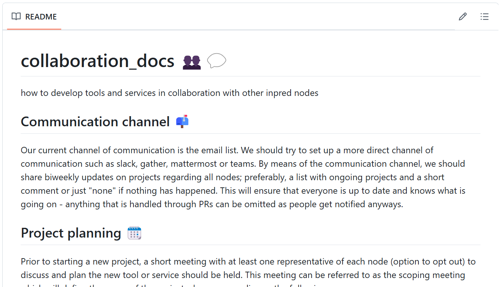

# In-house development and collaboration in InPreD-Norge

3rd Annual workshop on bioinformatics and variant interpretation in InPreD

<https://inpred.github.io/25-06_bioinfo_ws/develop_and_collab>

---

## Overview

1. Project planning
2. Development
3. Issue and bug handling
4. New features

---

This is a **private repo** at <https://github.com/InPreD/collaboration_docs> 
