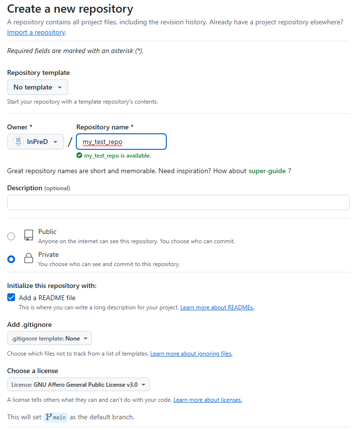

# In-house development and collaboration in InPreD-Norge

3rd Annual workshop on bioinformatics and variant interpretation in InPreD

<https://inpred.github.io/25-06_bioinfo_ws/develop_and_collab>

---

## Overview

1. Communication channel
2. Project planning
3. Development
4. Issue and bug handling
5. New features

---

This is a **private repo** at <https://github.com/InPreD/collaboration_docs> 

---

## 1. Communication channel

### Current situation

- as of today we communicate mainly via email
- some communication via Teams (most of us are "external" lacking some important features features)
- discussions on GitHub via PRs
- we have monthly meetings for updates and discussions

---

## 1. Communication channel

### Future plans

- requirements for platform/service for communication between nodes:
  - open source
  - easy and safe data sharing between nodes
  - free
  - self-hosted
- include bioinformaticians from clinical genetics departments (some of us are involved in CG already)
- currently, we are testing Zulip and Rocket.Chat
- biweekly updates from all nodes

---

## 2. Project Planning

- new projects should be started with a "scoping meeting" were at least one representative of each node
- the following should be discussed and agreed upon:
  - purpose
  - language (default: python)
  - interface (e.g. command line interface, web server)
  - data flow and storage (input and output location, database/filesystem)
  - involved collaborators (which nodes have resources to contribute)
  - deployment options (e.g. baremetal, docker/apptainer)
  - integration with existing projects
  - license (default: GNU AFFERO GENERAL PUBLIC LICENSE - Version 3)
  - intended timeline

---

## 3. Development

### 1. Code should be made available through InPreD group on GitHub

---

## 3. Development

### 2. Start off by creating a repository with an empty README.md and LICENSE file

- clone it to your local environment and then start developing

---

## 3. Development

### 3. Use the agreed branching strategy (suggested: simplified Gitflow workflow)

---

## 3. Development

### 4. Commit and push changes early and often to allow others to follow along

---

## 3. Development

### 5. Follow best practices for the selected programming language

- unit testing (cover test cases from different nodes)
- keeping functions short
- avoid hard-coding
- sensible use of packages and libraries

---

## 3. Development

### 6. Use git commit message conventions

- `feat`, `fix`, `ci`, `test`, `chore`, `docs`, `style`, `perf`, `build`, `refactor`

---

## 3. Development

### 7. Keep the features and PRs small (ideally one PR per feature) to have a tight feedback loop

- focus on one small problem for one feature
- include at least one representative from each node (option to opt out) and set a deadline (e.g. two weeks)

---

## 3. Development

### 8. Pair-programming should be used where it makes sense

- **pair-programming:** two programmers work together at one workstation; *driver* writes code while *observer/navigator* reviews each line of code as it is typed
- enable knowledge and expertise transfer between the different groups

---

## 3. Development

### 9. Use GitHub actions to test, lint and publish or build your project

---

## 3. Development

### 10. Provide at least a docker image (can be converted to apptainer)

- push them to the inpred group at docker hub

---

## 3. Development

### 11. Write documentation and check with others that it is understandable

---

## 3. Development

### 12. Tag and release code that is ready for production using semantic versioning

- `MAJOR`.`MINOR`.`PATCH`

---

## 4. Issue and bug handling

- report on GitHub and then handled there - discussion and code fixing tightly linked
- easier to find previous problems, share knowledge and track the development process

---

## 5. New features

- add as issues to the corresponding project
- discuss in the bioinformatics meetings or a small focus group meeting
- create a pull request from the issues and allow all nodes to give feedback on the implemented changes

---

Takk for oppmerksomheten

